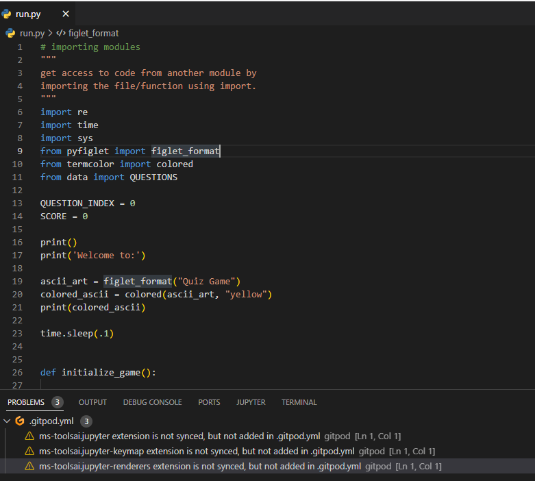

# Developer: Aldwin Arriola

[Live website](https://love-quiz-game.herokuapp.com/)

## Table of content
1. [Purpose of the project](#purpose-of-the-project)
2. [User stories](#user-stories)
3. [Features](#features)
4. [Color scheme](#color-scheme)
5. [Wireframes](#wireframes)
6. [Technology](#technology)
7. [Testing](#testing)
   - 7.1 Code Validation
   - 7.2 Fixed bugs
8. [Deployment](#deployment)
9. [Credits](#credits)

## Purpose of the project
The purpose of this project is for Project #3(Python), this is part of me achieving the Diploma in Full Stack Software Development at [Code Institute](https://codeinstitute.net/). Besides it is another General Knowledge, Fun Trivia question quiz game project, it can provide additional knowledge for the User.

## User stories
As a user:
  - there must be a username input.
  - there should be a choice whether I'm ready to play or not.
  - I should have a choice to answer each question.
  - question number must be displayed.
  - the score of correct answer should be displayed.
  - if my answer is wrong, I should see the correct answer to the question.
  - every correct answer should increase my score.
  - after I answer all the questions I should see the total of my final score.
  - at the end of the game I should have a choice whether to repeat the game or not.

## Features
- ### A Simple, Easy to Remember URL:[https://love-quiz-game.herokuapp.com/](https://love-quiz-game.herokuapp.com/)
-----

-----

 - ### Future features
    
 -----     
## Color scheme
- 

       
 Color Scheme 

       
       
     - I used these colors to make the quiz app look good and enhance user experience.
       

-----
## Wireframes

-----
## Technology
### Languages used
- [Python](https://www.python.org/)
### Others

- [Google Fonts](https://fonts.google.com) - where i import and use font-style for this project.
- [Git](http://gitscm.com) - Git was used for version control by utilizing the Gitpod terminal to commit to Git and Push to GitHub.
- [Gitpod](https://gitpod.io) - IDE used to code the project.
- [GitHub](https://github.com) - GitHub is used to store the project's code after being pushed from Git.
- Visual Studio Code for Windows - IDE used to code the project.
- Windows Snipping Tool - used to save the screen shot.

-----
## Testing
### 7.1 Code Validation
- 

       
PEP8 Python Validator

       
       
     - No Errors or Warnings found.
       

### 7.2 fixed bugs
Bugs

- When typing username, it has no validation, anything can be input like special characters and there is no limit on how many charcters can be entered. and when nothing is written it can also continue in the game.
   - 

       
To fix

       - I put a conditional statement.

      ------

       
       

- Score and questionindex do not increment after each correct answer and question.
   - 

       
To fix

       - To solve the error, I mark the variable as ***global*** in your function definition.

      ------

       

      ------

       
       

- When playing again, the incrementing of the question number and score continues where it should the score and question number back into zero.
   - 

       
To fix

       - To solve the error, I mark the variable as ***global*** in your function definition.

      ------

        
       

   
-----
## Deployment
- via Heroku
     - go and log in to [Heroku]((https://id.heroku.com/login))
     - from the Heroku dashboard "Create new app".
     - name app adjust it to something unique, select region and clicked   "Create   app".
     - after creating, proceed to the Settings and click "Config Var", in field Type the key is PORT and the value is 8000, and then click "Add".
     - next step is Scroll down and "Add buildpack". Add "python" buildpack first and then save changes, then add "nodejs" and click save again. build pack should be in order. python on top and nodejs  at the bottom.
     - go to Deploy section. In deployment method select "GitHub", and confirm to "connect to GitHub".
     - search for Github repository name and clicked "connect".
     - scroll down and choose if "Automatic deploys" or "Manual deploy", then click "Deploy branch".
     - after clicking "Deploy branch" the app is being built, App will successfully deploy after couple of minutes and click "view".
     - the link will proceed and open our mock terminal.

## Credits
   - [W3C School](https://www.w3schools.com/) - for more knowledge that I learned.
   - [freecodecamp.org/](https://www.freecodecamp.org/)
   - [stackoverflow.com](https://stackoverflow.com/) - Learning guide.
   - [programiz.com](https://www.programiz.com/) - 
   - [PEP 8](https://peps.python.org/pep-0008/) – Style Guide for Python Code.
   - [Youtube.com](https://www.youtube.com/) - For Python tutorials.
   - [quiztriviagames.com](https://www.quiztriviagames.com/multiple-choice-trivia-questions/) - I get my questions and answers.
## Acknowledgements
   - @Mr. Rohit to my mentor
   - @Jay Rodriguez
   - @Zack Owen
   - @Warwick Hart
   - @Student Support
   - @Slack community
   - @Code institute

## Disclaimer
   - love-quiz-game was created for educational purpose only.