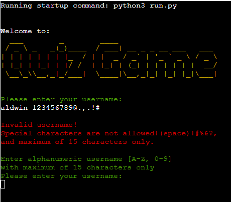
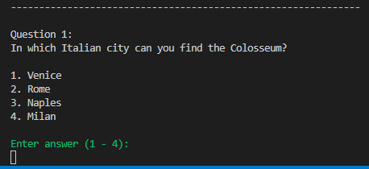
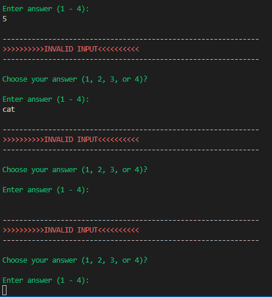

# Developer: Aldwin Arriola

[Live website](https://love-quiz-game.herokuapp.com/)

## Table of content
1. [Purpose of the project](#purpose-of-the-project)
2. [User stories](#user-stories)
3. [Features](#features)
4. [Color scheme](#color-scheme)
5. [Flowchart](#flowchart)
6. [Technology](#technology)
7. [Testing](#testing)
   - 7.1 Code Validation
   - 7.2 Fixed bugs
   - 7.3 Test cases
8. [Deployment](#deployment)
9. [Credits](#credits)

## Purpose of the project
The purpose of this project is for Project #3(Python), this is part of me achieving the Diploma in Full Stack Software Development at [Code Institute](https://codeinstitute.net/). Besides it is another General Knowledge, Fun Trivia question quiz game project, it can provide additional knowledge for the User.

## User stories
As a user:
  - there must be a main menu with a graphic welcome message.
  - there must be a username input.
  - there should be a choice whether I'm ready to play or not.
  - I should have a choice to answer each question.
  - question number must be displayed.
  - the score of correct answer should be displayed.
  - if my answer is wrong, I should see the correct answer to the question.
  - every correct answer should increase my score.
  - after I answer all the questions I should see the total of my final score.
  - at the end of the game I should have a options whether to play the game again or not.

## Features
- ### A Simple, Easy to Remember URL:[https://love-quiz-game.herokuapp.com/](https://love-quiz-game.herokuapp.com/)
-----
### Main Menu
 - 

       
 Display Welcome Message 

       
       

       - It has a graphic welcome message.

### User name input
- 

       
 Ask User for Username input 

       
       

       - User are not allowed to use Special Characters.
       - User are not allowed to have a more than 15 Characters.

### Play game options
- 

       
 start option screen shot 

       
       

       -  User may type input "start,Start,sTaRt, ..." only.
       -  when user input is valid it will display a message to proceed into the main game.

- 

       
 exit screen shot 

       
       

       -  User may type input "exit,EXIT,exit, ..." only.
       -  when user input is valid it will display a message quote and exit the game. 

### Main Game
- 

       
 Display Question no., Question, and Option screen shot

       
       

- 

       
 User answer input validation screen shot

       
       

       - User must only select numbers from 1 - 4 or else it will be invalid and return to input an answer.
       - after choosing a valid answer it will proceed to the next question.

- 

       
 check user answer screen shot

       
       

       - when User answer is wrong, it will display a message "Incorrect", 
         after that it will display the correct answer, and then display the User's current score.
       - if the User answer is correct, it will display a message "Correct", 
         and add +1 score to User's current score.

### End game options
- 

       
 display final score screen shot 

       
       

       - when User are finish answering all the question, it will display a message "Congratulations...
         Calculating total of score..." 
       - it will display Final Score of the User's all correct answers out of total lenght of questions.

- 

       
 play again screen shot 

       
       

       - User may tpye "yes,YES,yEs, ..." to play again.

- 

       
 exit game screen shot 

       
       

       - User may tpye anything to exit the game except "yes,YES,yEs, 'space'Yes ..."
       - it will display a quote message and "exiting the game..."

-----

 - ### Future features
    - Add more questions 
    - Make questions random
    - Highest scores
 -----     
## Color scheme
- [termcolor](https://pypi.org/project/termcolor/) - Module used to achieve text color in Terminal.
  - How to install termcolor in Python [(Click the link)](https://blog.finxter.com/how-to-install-termcolor-in-python/).
  - How to import and use termcolor in python [(Click the link)](https://pypi.org/project/termcolor/).
    
- 

       
 Color Scheme screen shot

       
       
     - I used these colors to make the quiz app text look good and enhance user experience.
       - Red - For Incorrect and Invalid text.
       - Blue - For correct answer text.
       - Green - Mostly message text before entering answer to input.
       - Yellow - Welcome message, current score, final score text.
       - White - Is normal or default text color from the terminal.
       

-----
## Flowchart

- [Quiz Game flowchart](https://lucid.app/lucidchart/682080d9-52a3-4cfb-97e4-d4db0ea5a972/edit?viewport_loc=-374%2C-119%2C2994%2C1481%2C0_0&invitationId=inv_187ec8c7-02cc-423c-b08d-85ee8d078fe9#)

- 

       
 Flowchart Screenshot

       
       

-----
## Technology
### Languages used
- [Python](https://www.python.org/)
### Others
- [Termcolor](https://pypi.org/project/termcolor/) - Module used to achieve text color in Terminal.
- [Lucidchart](https://www.lucidchart.com/) - Tools used to build a flowchart.
- [Google Fonts](https://fonts.google.com) - Where i import and use font-style for this project.
- [Git](http://gitscm.com) - Git was used for version control by utilizing the Gitpod terminal to commit to Git and Push to GitHub.
- [Gitpod](https://gitpod.io) - IDE used to code the project.
- [GitHub](https://github.com) - GitHub is used to store the project's code after being pushed from Git.
- Visual Studio Code for Windows - IDE used to code the project.
- Windows Snipping Tool - Used to save the screen shot.

-----

## Testing

### 7.1 Code Validation
- 

       
PEP8 Python Validator

       
       
     - No Errors or Warnings found.
       

------

### 7.2 fixed bugs
Bugs

- When typing username, it has no validation, anything can be input like special characters and there is no limit on how many charcters can be entered. and when nothing is written it can also continue in the game.
   - 

       
To fix

       - I put a conditional statement.

      ------

       
       

- Score and questionindex do not increment after each correct answer and question.
   - 

       
To fix

       - To solve the error, I mark the variable as ***global*** in your function definition.

      ------

       

      ------

       
       

- When playing again, the incrementing of the question number and score continues where it should the score and question number back into zero.
   - 

       
To fix

       - To solve the error, I mark the variable as ***global*** in your function definition.

      ------

        
       

------

### 7.3 Test Cases
| Test Case ID | Test Case Description | Test Steps | Test Data | Expected Result | Actual Result| Pass/Fail |
| :---: | :---: | --- | --- |--- | :---: | :---: |
| TC01 | Username input Valid. | 1. Go to site [https://love-quiz-game.herokuapp.com/](https://love-quiz-game.herokuapp.com/). 2. Type a username input. 3. Press Enter. | Username = Aldwin | User should proceed to start/exit option. | As Expected | Pass 
 
Test case 01 screen shot
  
 |
| TC02 | Username input Invalid. | 1. Go to site [https://love-quiz-game.herokuapp.com/](https://love-quiz-game.herokuapp.com/). 2. Type a username input. 3. Press Enter. | Username = aldwin@codeinstitute | 1. User should not proceed to start/exit option. 2. User will be ask  to Enter username again. | As Expected | Pass 
 
Test case 02 screen shot
  
 |
| TC03 |  User main menu option (starting the game). | 1. Go to site [https://love-quiz-game.herokuapp.com/](https://love-quiz-game.herokuapp.com/). 2. Type a correct username input. 3. Press Enter. 4. Type Start. 5. Press Enter. | Type  = start | User should  proceed to the Quiz first question. | As Expected |Pass 
 
Test case 03 screen shot
  
 |
| TC04 |  User main menu option (Exiting the game). | 1. Go to site [https://love-quiz-game.herokuapp.com/](https://love-quiz-game.herokuapp.com/). 2. Type a correct username input. 3. Press Enter. 4. Type Exit. 5. Press Enter. | Type = exit | User should  exit the game. | As Expected | Pass 
 
Test case 04 screen shot
  
 |
| TC05 |  Check User Correct answer. | 1. Go to site [https://love-quiz-game.herokuapp.com/](https://love-quiz-game.herokuapp.com/). 2. Type a correct username input. 3. Press Enter. 4. Type Start. 5. Press Enter. 6. Type the correct answer. 7. Press Enter. | Type = 2 (is the correct answer in Question number 1). | 1. Display Message Correct. 2. Display user current score. 3. User should proceed to the next question. | As Expected | Pass 
 
Test case 05 screen shot
  
 |
| TC06 |  Check User Incorrect answer. | 1. Continuing procedure from TC05 (Question number 2). 2. Type the Incorrect answer. 3. Press Enter. | Type = 3 (is the incorrect answer in Question number 2). | 1. Display message answer is Incorrect. 2. Display the Correct asnwer. 3. Display user current score. 4. User should proceed to the next question. | As Expected | Pass 
 
Test case 06 screen shot
  
 |

   
-----
## Deployment
- via gitpod
   - go to and log in to [github](https://github.com/).
   - after login. on the top right side of the page next to the bell icon click on the "+" and select "New repository".
   - now i can create a new repository. put repository template, repository name, its description and other options, after that just go to the bottom and press "Create repository" and then it take me to gitpod.

- via Heroku
     - go and log in to [Heroku]((https://id.heroku.com/login))
     - from the Heroku dashboard "Create new app".
     - name app adjust it to something unique, select region and clicked   "Create   app".
     - after creating, proceed to the Settings and click "Config Var", in field Type the key is PORT and the value is 8000, and then click "Add".
     - next step is Scroll down and "Add buildpack". Add "python" buildpack first and then save changes, then add "nodejs" and click save again. build pack should be in order. python on top and nodejs  at the bottom.
     - go to Deploy section. In deployment method select "GitHub", and confirm to "connect to GitHub".
     - search for Github repository name and clicked "connect".
     - scroll down and choose if "Automatic deploys" or "Manual deploy", then click "Deploy branch".
     - after clicking "Deploy branch" the app is being built, App will successfully deploy after couple of minutes and click "view".
     - the link will proceed and open our mock terminal.

## Credits
   - [W3C School](https://www.w3schools.com/) - for more knowledge that I learned.
   - [freecodecamp.org/](https://www.freecodecamp.org/)
   - [stackoverflow.com](https://stackoverflow.com/) - Learning guide.
   - [programiz.com](https://www.programiz.com/) - 
   - [PEP 8](https://peps.python.org/pep-0008/) – Style Guide for Python Code.
   - [Youtube.com](https://www.youtube.com/) - For Python tutorials.
   - [quiztriviagames.com](https://www.quiztriviagames.com/multiple-choice-trivia-questions/) - I get my questions and answers.
   - [Finxter](https://blog.finxter.com/how-to-install-termcolor-in-python/) - Guide on how to install termcolor in Python.
   - [pypi.org](https://pypi.org/project/termcolor/) - Guide on how to use termcolor module.
## Acknowledgements
   - @Mr. Rohit to my mentor
   - @Jay Rodriguez
   - @Zack Owen
   - @Warwick Hart
   - @Student Support
   - @Slack community
   - @Code institute

## Disclaimer
   - love-quiz-game was created for educational purpose only.